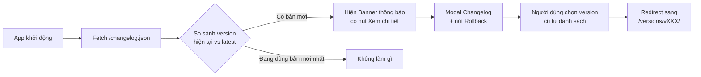

# Kế hoạch: Hệ thống Quản lý Phiên bản (Version Manager)

## Mô tả vấn đề

Do ứng dụng là một **Word Add-in tĩnh** (static site) chạy trên GitHub Pages, không có backend, chúng ta cần xây dựng hệ thống version hoàn toàn ở phía client.

---

## Kiến trúc Đề xuất

### Cơ chế hoạt động tổng thể



### 3 thành phần cần triển khai

---

### 1. `changelog.json` (file tĩnh deploy cùng app)
Lưu toàn bộ lịch sử phiên bản, **tự động cập nhật khi deploy**:

```json
{
  "latest": "v14052026.1055",
  "versions": [
    {
      "version": "v14052026.1055",
      "date": "14/05/2026",
      "changes": [
        "Fix lỗi không xóa viền bảng (No Border)",
        "Thêm tag Tư vấn Thiết kế (designRep)",
        "Layout 4 cột nhất quán ở Bảng thành phần tham gia"
      ],
      "path": "/HoSoQuanLyChatLuong/"
    },
    {
      "version": "v14052026.1035",
      "date": "14/05/2026",
      "changes": [
        "Thêm Đơn vị Ký Tùy chỉnh (Custom Group)",
        "Tối ưu Form Ký Trống: điền sẵn dải dấu chấm",
        "Xưng hô Ông (Bà) khi để trống thông tin"
      ],
      "path": "/HoSoQuanLyChatLuong/versions/v14052026.1035/"
    }
  ]
}
```

---

### 2. Hệ thống lưu trữ phiên bản cũ (trong `gh-pages`)

Mỗi lần deploy, **kịch bản PowerShell** sẽ tự động:
1. Copy bản build hiện tại vào thư mục `versions/vXXX/` trên nhánh `gh-pages`
2. Cập nhật `changelog.json` với phiên bản mới
3. Push bản mới nhất lên thư mục root

Kết quả cây thư mục trên `gh-pages`:
```
gh-pages/
├── index.html         ← Bản mới nhất
├── assets/
├── changelog.json     ← Lịch sử tất cả version
└── versions/
    ├── v14052026.1035/
    │   ├── index.html
    │   └── assets/
    └── v14052026.1009/
        ├── index.html
        └── assets/
```

---

### 3. `VersionNotification` Component (UI)

Thêm vào `Topbar.tsx` — tự động:
- Fetch `changelog.json` mỗi khi app load
- **Nếu `latest` khác với version đang chạy**: Hiện badge đỏ nhấp nháy trên nút "Cập nhật"
- **Khi bấm**: Mở modal đẹp với:
  - Danh sách thay đổi của bản mới (hoặc hiện tại)
  - Nút **"Cập nhật ngay"** → reload về root (bản mới nhất)
  - Danh sách các phiên bản cũ có nút **"Sử dụng phiên bản này"** → redirect sang `/versions/vXXX/`

---

## Open Questions

> [!IMPORTANT]
> **Câu hỏi 1: Lưu bao nhiêu phiên bản cũ?**
> Mỗi phiên bản chiếm ~400KB. Bạn muốn giữ **tối đa bao nhiêu** phiên bản cũ trong kho? (Đề xuất: 5 phiên bản gần nhất)

> [!IMPORTANT]
> **Câu hỏi 2: Hành vi thông báo**
> Khi mở Add-in và có bản mới:
> - **Phương án A**: Hiện popup/modal ngay lập tức (không cần bấm)
> - **Phương án B**: Chỉ hiện badge đỏ nhấp nháy trên nút Cập nhật, người dùng tự bấm để xem

> [!NOTE]
> **Lưu ý kỹ thuật**: Do Word Add-in có thể cache mạnh, nút "Rollback" sẽ dùng `?v=timestamp` để bỏ qua cache khi chuyển hướng sang phiên bản cũ. Dữ liệu người dùng (localStorage) không bị ảnh hưởng khi rollback vì cùng domain.

---

## Proposed Changes

### Deploy Script
#### [MODIFY] [deploy_gh_pages.ps1](file:///c:/Users/buiqu/.gemini/antigravity/scratch/HoSoQuanLyChatLuong/deploy_gh_pages.ps1)
- Thêm bước lưu bản cũ vào `dist/versions/vXXX/` trước khi push
- Tự động tạo và cập nhật `dist/changelog.json`

### Frontend
#### [NEW] `src/components/VersionManager.tsx`
- Component fetch `changelog.json`, so sánh version, hiển thị badge và modal

#### [MODIFY] [Topbar.tsx](file:///c:/Users/buiqu/.gemini/antigravity/scratch/HoSoQuanLyChatLuong/src/components/Topbar.tsx)
- Tích hợp `VersionManager` vào thanh điều hướng

---

## Verification Plan
1. Build và deploy → kiểm tra `changelog.json` và thư mục `versions/` xuất hiện đúng trên gh-pages
2. Đổi version string để giả lập "đang dùng bản cũ" → kiểm tra badge thông báo xuất hiện
3. Bấm Rollback → kiểm tra redirect sang `versions/vXXX/` và app chạy đúng
